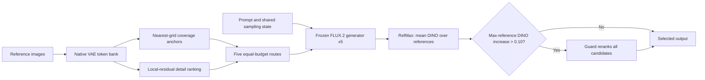

# Q-Margin

> Same-budget reference-token routing and target-image-free candidate selection for subject-driven image generation with a frozen FLUX.2 Klein generator.


Q-Margin is an inference-time framework for balancing global spatial coverage and locally discriminative detail in reference-guided subject generation. It constructs five equal-token-budget routes, generates one candidate per route with shared sampling conditions, and selects a candidate using only reference-side signals.

The method trains no new parameters and loads no LoRA, learned reference adapter, or subject-specific checkpoint. It does rely on pretrained FLUX.2 and DINOv2 models. The repository and Python package retain the historical name `Q-Margin-FlowLoRA` / `qmargin-flowlora`, but the method implemented here is **Q-Margin**, not a LoRA-training method.


## Method overview

A fixed reference-token allocation may not provide the right balance for every subject, reference view, and prompt:

- **Coverage tokens** preserve the subject's coarse shape, part relationships, and spatial extent.
- **Detail tokens** emphasize boundaries, textures, materials, and other locally discriminative regions.

Q-Margin treats this allocation as a sample-specific routing and selection problem.



### 1. Native reference-token bank

Each reference is converted to RGB, center-cropped/resized to `256 x 256`, encoded by the frozen generator's native VAE, and packed into a `16 x 16` grid of 256 native tokens. The token bank retains each token's feature, spatial identifier, reference-image identity, and local detail score.

For token `x[j,n]`, Q-Margin uses the L2 residual from its local `3 x 3` token-space mean as the detail score:

```text
rho[j,n] = ||x[j,n] - mean_3x3(x[j,n])||_2
```

This is a local high-pass proxy, not a manually annotated semantic part or texture label.

### 2. Equal-budget coverage-detail routes

For every reference image, a route `s = (a, d)` selects `a` nearest-grid coverage anchors and `d` highest-residual non-anchor tokens. Anchor and detail sets are disjoint, and every route retains exactly `K = a + d = 144` unique tokens per reference.

| Route | Coverage anchors | Detail tokens | Role |
|---|---:|---:|---|
| `(64, 80)` | 64 | 80 | Internal baseline; strongest coverage |
| `(48, 96)` | 48 | 96 | Mild detail emphasis |
| `(32, 112)` | 32 | 112 | Moderate detail emphasis |
| `(16, 128)` | 16 | 128 | Strong detail emphasis |
| `(0, 144)` | 0 | 144 | Pure-detail boundary case |

All five candidates share the same prompt, initial noise, sampler, timestep schedule, guidance settings, and frozen generator. “Same-budget” means the per-candidate reference-token budget is controlled; Q-Margin still performs five generation runs per input.

### 3. RefMax and conditional Guard

RefMax computes DINOv2 cosine similarity between each candidate and every reference, averages across references, and maximizes only across candidates:

```text
Q_ref(candidate) = mean_j cosine(DINO(candidate), DINO(reference_j))
```

The `(64, 80)` route is the baseline. If the RefMax candidate's maximum single-reference DINO similarity exceeds the baseline by more than `0.10`, Guard reranks the complete candidate set:

```text
Q_guard = Q_ref - 0.50 * max_reference_global_RGB_SSIM - 0.25 * max_reference_DINO
```

Both penalty terms take the maximum over individual reference images. The global RGB SSIM term is a whole-image risk proxy. It is not the sliding-window Copy SSIM reported by the paper's full evaluation stack. Guard is a conditional proxy-based reranker, not a copy detector or a hard safety guarantee.

Target images are not used for route construction, candidate generation, Guard triggering, or final selection. The evaluation scripts may read target images to measure the selected outputs after inference.

## Scope of this release

Included:

- native FLUX.2 reference encoding, token packing, and position-ID handling;
- nearest-grid anchors, local-residual detail scoring, deduplication, and native-ID sorting;
- five controlled coverage-detail routes and shared-state candidate generation;
- compact DINOv2, CLIP, and global-RGB-SSIM metric extraction;
- offline RefMax + Guard analysis;
- SOP-oriented manifests, validators, ablation/figure scripts, CPU contract tests, and two local-input editing demos.

Not included:

- FLUX.2, DINOv2, or CLIP weights;
- DreamBench++ or Stanford Online Products images;
- generated experiment outputs, paper figures, private evidence bundles, or the paper source tree;
- IP-Adapter-Plus, SSR-Encoder, or other external comparison systems;
- the complete SigLIP2/ImageReward/sliding-window Copy SSIM/Absolute Copy Risk evaluation stack;
- a one-command target-free deployment selector for `single_reference_no_target` manifests;
- the optional independently maintained formal evaluation wrapper.

The retained workflow supports the core generator, metric-table, and selector path. It should not be described as a bitwise reproduction of every paper table.

## Repository layout

```text
assets/readme/                    versioned documentation demo images
configs/                          frozen Q-Margin runtime configuration
data/eval/                        lightweight evaluation manifests
data/subjects/subjects_*.jsonl    canonical subject index only
demos/bicycle_edit/               pixel-locked background replacement recipe
demos/sofa_edit/                  full-image FlowMatch img2img recipe
docs/REPRODUCIBILITY.md           supported evaluation-oriented workflow
qmargin/                          inference and reference-token runtime
scripts/run_v2_8_ctnr_oracle.py   five-route candidate generation
scripts/evaluate_fixed_reference_metrics.py
                                   DINO/CLIP/global-SSIM metric tables
scripts/analyze_v2_14_refmax_guard_hybrid.py
                                   RefMax + Guard selection analysis
tests/                             CPU unit, contract, and hygiene tests
```

Large model, dataset, output, cache, and temporary trees are intentionally ignored by Git. See [`data/README.md`](data/README.md) for path and data-boundary rules.

## Requirements

| Component | Requirement |
|---|---|
| Python | `>= 3.11` |
| GPU inference | NVIDIA GPU with CUDA and BF16 support |
| VRAM | 24 GB or more recommended for this implementation; tested on an RTX 4090 |
| System memory | 32 GB or more recommended |
| Disk | At least 50 GB free for the environment, model, cache, and outputs |
| CPU tests | No GPU or model download required |

Black Forest Labs documents lower-memory configurations for FLUX.2 Klein when CPU offload is enabled. This repository currently moves the complete pipeline to the selected device and does not expose CPU offload or `device_map` options, so those lower figures are not an established minimum for this code.

### Environment distinction

The repository and paper record two different environments:

| Purpose | PyTorch / CUDA | Diffusers | Transformers | scikit-image |
|---|---|---:|---:|---:|
| Current repository dependency snapshot | `2.11.0+cu128` | `0.38.0` | `5.10.2` | not required by the retained compact proxy |
| Paper evaluation environment | `2.5.1 / CUDA 12.1` | `0.38.0` | `4.57.6` | `0.24.0` |

`requirements.freeze.txt` is the current release's pinned direct-dependency snapshot. It is not the paper's exact transitive lock, and the upstream model revision is not yet frozen in this repository. Record package versions, the downloaded model commit, and GPU information with formal runs.

## Installation

Commands below use PowerShell and assume execution from the repository root.

### Full CUDA environment

The repository is currently private, so cloning requires the access URL supplied by the repository host or review venue.

```powershell
$repositoryUrl = Read-Host "Repository clone URL"
git clone $repositoryUrl Q-Margin-FlowLoRA
Set-Location "Q-Margin-FlowLoRA"

py -3.11 -m venv .venv
.\.venv\Scripts\python.exe -m pip install pip==26.2.1 setuptools==78.1.0 wheel==0.46.3 packaging==26.0
.\.venv\Scripts\python.exe -m pip install `
  --index-url https://pypi.org/simple `
  --extra-index-url https://download.pytorch.org/whl/cu128 `
  -r requirements.freeze.txt
```

Use an NVIDIA driver compatible with the official PyTorch CUDA 12.8 wheels. Every command block in this README is PowerShell. On Linux, either run PowerShell 7 (`pwsh`) and replace `py -3.11` with `python3.11` and `.\.venv\Scripts\python.exe` with `./.venv/bin/python`, or translate the later `Join-Path`, `$env:`, `&`, and backtick syntax to Bash.

### CPU-only test environment

Use a separate environment for CPU tests; it intentionally omits Diffusers and the model weights.

```powershell
py -3.11 -m venv .venv-cpu
.\.venv-cpu\Scripts\python.exe -m pip install pip==26.2.1 setuptools==78.1.0 wheel==0.46.3 packaging==26.0
.\.venv-cpu\Scripts\python.exe -m pip install torch==2.11.0 torchvision==0.26.0 --index-url https://download.pytorch.org/whl/cpu
.\.venv-cpu\Scripts\python.exe -m pip install numpy==2.4.4 Pillow==12.2.0 PyYAML==6.0.3 pytest==9.0.3
.\.venv-cpu\Scripts\python.exe -m pip install -e ".[test]" --no-deps --no-build-isolation

$env:HF_HUB_OFFLINE = "1"
$env:TRANSFORMERS_OFFLINE = "1"
$env:DIFFUSERS_OFFLINE = "1"
.\.venv-cpu\Scripts\python.exe -m pytest -q
```

Do not use the CPU-only environment for image generation. `ModuleNotFoundError: No module named 'diffusers'` usually means the test environment was used instead of the full CUDA environment.

## Pretrained weights

| Model | Required for | Upstream ID | Expected location |
|---|---|---|---|
| FLUX.2 Klein 4B Base | candidate/background generation | [`black-forest-labs/FLUX.2-klein-base-4B`](https://huggingface.co/black-forest-labs/FLUX.2-klein-base-4B) | `models/FLUX.2-klein-base-4B/` |
| DINOv2 Base | RefMax and reference-consistency metrics | [`facebook/dinov2-base`](https://huggingface.co/facebook/dinov2-base) | Hugging Face cache |
| CLIP ViT-B/32 | optional prompt-alignment metrics | [`openai/clip-vit-base-patch32`](https://huggingface.co/openai/clip-vit-base-patch32) | Hugging Face cache |

Download the FLUX.2 Diffusers repository to the path expected by the YAML files:

```powershell
$project = (Get-Location).Path
$hf = Join-Path $project ".venv\Scripts\hf.exe"
New-Item -ItemType Directory -Force (Join-Path $project "models") | Out-Null
& $hf download black-forest-labs/FLUX.2-klein-base-4B `
  --local-dir (Join-Path $project "models\FLUX.2-klein-base-4B")
```

The `hf download ... --local-dir ...` interface is documented by [Hugging Face Hub](https://huggingface.co/docs/huggingface_hub/en/package_reference/cli#hf-download). DINOv2 and CLIP are downloaded automatically on the first metric run unless they are already cached. To prefetch them:

```powershell
& $hf download facebook/dinov2-base
& $hf download openai/clip-vit-base-patch32
```

After all files are cached, offline metric runs can set:

```powershell
$env:HF_HUB_OFFLINE = "1"
$env:TRANSFORMERS_OFFLINE = "1"
$env:DIFFUSERS_OFFLINE = "1"
```

Add `--local_files_only` to `evaluate_fixed_reference_metrics.py` in offline mode. A missing cache entry then fails intentionally instead of contacting the Hub.

No LoRA, adapter, or extra Q-Margin checkpoint is required. The frozen route runner rejects `--checkpoint` in the publication protocol.

## Run the bicycle demo

This runnable demo needs only the tracked synthetic input and the local FLUX.2 weights. It uses the displayed input and reproduces the procedure that generated the displayed background and final edit.

```powershell
$project = (Get-Location).Path
$python = Join-Path $project ".venv\Scripts\python.exe"
$script = Join-Path $project "scripts\run_background_replace.py"
$config = Join-Path $project "demos\bicycle_edit\edit_config_512.yaml"
$source = Join-Path $project "assets\readme\bicycle_input.png"
$output = Join-Path $project "outputs\bicycle_readme_demo"

& $python $script `
  --config $config `
  --source_image $source `
  --output_dir $output `
  --background_prompt "An empty photorealistic alpine forest trail at golden hour, warm sunlight filtering through pine trees, natural ground, realistic depth, and a clear open center for a product; no bicycle, no bike, no vehicle, no people, no animals, no text, no watermark." `
  --width 512 `
  --height 512 `
  --num_inference_steps 30 `
  --guidance_scale 1.0 `
  --seed 20260901 `
  --device cuda `
  --transparent_distance 6 `
  --opaque_distance 96 `
  --edge_feather_radius 1 `
  --core_neighbor_distance 64 `
  --bottom_start_y 350 `
  --bottom_end_y 400 `
  --bottom_transparent_distance 96 `
  --bottom_opaque_distance 160 `
  --bottom_core_neighbor_distance 128
```

Expected files:

```text
outputs/bicycle_readme_demo/
  000000.png          final edited image
  background.png      generated empty background
  foreground_mask.png extraction/alpha mask
  metadata.json       prompt, seed, hashes, and pixel-identity audit
```

The script centers the `500 x 500` source inside the `512 x 512` background without resizing. White-screen extraction is intentionally conservative; pale subjects, colored source backgrounds, and strong studio shadows are known failure modes. See [`demos/bicycle_edit/README.md`](demos/bicycle_edit/README.md).

The versioned images are reference outputs, not a bitwise reproducibility promise. Exact background pixels may differ when the upstream model revision, PyTorch/CUDA stack, or GPU changes; the saved `metadata.json` records the prompt, seed, hashes, and preservation audit for each local run.

## Run the SOP-oriented Q-Margin evaluation workflow

The current end-to-end generator/metric/selector workflow is the retained SOP-oriented, multi-reference path. It uses the `fixed_reference` JSONL schema, whose validator requires every record to provide:

```text
case_id
subject_id
category
prompt
seed
target_image
single_reference_images
multi_reference_images
```

Target paths are used by offline evaluation, not by route construction or candidate selection. Relative image paths resolve against the same project/data root passed to generation and metrics.

`single_reference_images` must contain exactly one path and `multi_reference_images` at least two paths. The generator uses the multi-reference list in this workflow. Every manifest record must also contain an explicit deterministic seed, and all five routes for that record reuse the same sampling state. The SOP protocol uses the prescribed per-sample seeds stored in its frozen manifests; do not replace them with `42`. Supply the authorized SOP image tree before running this section.

The paper's DreamBench++ experiment is single-reference and uses seed `42`. This release can generate a single-reference, target-free candidate with the separate `single_reference_no_target` schema, but that schema cannot be passed to the fixed-reference evaluator below. A complete DreamBench++ generator-to-metrics-to-selector workflow is therefore not bundled; the commands in this section must not be presented as a DreamBench++ reproduction path.

### 1. Set portable paths and validate the manifest

```powershell
$project = (Get-Location).Path
$python = Join-Path $project ".venv\Scripts\python.exe"
$evalSet = (Resolve-Path (Read-Host "Path to your SOP fixed_reference JSONL")).Path
$config = Join-Path $project "configs\qm_ref_sop_small_valid_native_vae_native_coreset_k144_eval.yaml"
$candidateRoot = Join-Path $project "outputs\reproduction\candidates"
$metricRoot = Join-Path $project "outputs\reproduction\metrics"
$selectionRoot = Join-Path $project "outputs\reproduction\refmax_guard"

& $python (Join-Path $project "scripts\validate_fixed_reference_eval.py") `
  --eval_set $evalSet `
  --root $project
```

### 2. Generate the five equal-budget routes

```powershell
& $python (Join-Path $project "scripts\run_v2_8_ctnr_oracle.py") `
  --config $config `
  --eval_set $evalSet `
  --root $project `
  --output_root $candidateRoot `
  --height 512 `
  --width 512 `
  --num_inference_steps 30 `
  --guidance_scale 1.0 `
  --methods v2_8a_static_a064_d080 v2_8a_static_a048_d096 v2_8a_static_a032_d112 v2_8a_static_a016_d128 v2_8a_static_a000_d144 `
  --device cuda
```

Seeds are read from the JSONL; the runner has no `--seed` option. The paper intentionally uses 30 steps and guidance `1.0`, which differ from the upstream Base model's reference defaults.

Each case/route directory contains `000000.png`, `latents_packed.pt`, `gate_trace.json`, and `metadata.json`. The candidate root also contains `summary.json`.

### 3. Compute reference and target-side evaluation metrics

```powershell
& $python (Join-Path $project "scripts\evaluate_fixed_reference_metrics.py") `
  --eval_set $evalSet `
  --project_root $project `
  --method v2_8a_static_a064_d080 $candidateRoot v2_8a_static_a064_d080 `
  --method v2_8a_static_a048_d096 $candidateRoot v2_8a_static_a048_d096 `
  --method v2_8a_static_a032_d112 $candidateRoot v2_8a_static_a032_d112 `
  --method v2_8a_static_a016_d128 $candidateRoot v2_8a_static_a016_d128 `
  --method v2_8a_static_a000_d144 $candidateRoot v2_8a_static_a000_d144 `
  --output_dir $metricRoot `
  --feature_backend dino `
  --prompt_backend clip `
  --device cuda
```

Expected files are `case_metrics.csv`, `method_summary.csv`, and `summary.json`.

### 4. Apply RefMax + Guard

```powershell
$caseMetrics = Join-Path $metricRoot "case_metrics.csv"

& $python (Join-Path $project "scripts\analyze_v2_14_refmax_guard_hybrid.py") `
  --eval_run local_fixed_eval $caseMetrics `
  --output_dir $selectionRoot `
  --baseline_method v2_8a_static_a064_d080 `
  --candidate_methods v2_8a_static_a064_d080 v2_8a_static_a048_d096 v2_8a_static_a032_d112 v2_8a_static_a016_d128 v2_8a_static_a000_d144 `
  --dino_copy_delta_threshold 0.10 `
  --bootstrap_iterations 10000
```

Expected files are `v2_14_refmax_guard_hybrid_predictions.csv` and `v2_14_refmax_guard_hybrid_summary.json`.

For schemas, preprocessing details, output contracts, and the optional external wrapper, see [`docs/REPRODUCIBILITY.md`](docs/REPRODUCIBILITY.md).

## Additional editing demo

[`demos/sofa_edit/README.md`](demos/sofa_edit/README.md) documents full-image FlowMatch img2img editing. Unlike the bicycle compositing path, the diffusion model rewrites the complete image, so geometry, colors, fine details, and proportions may change. It is a deployment example, not the paper's quantitative protocol.

## Tests

The CPU suite does not download models or require a GPU:

```powershell
$env:HF_HUB_OFFLINE = "1"
$env:TRANSFORMERS_OFFLINE = "1"
$env:DIFFUSERS_OFFLINE = "1"
.\.venv-cpu\Scripts\python.exe -m pytest -q
```

External-wrapper tests skip unless `QMARGIN_EXTERNAL_WRAPPER` points to an independently obtained wrapper:

```powershell
$wrapperPath = Read-Host "Path to the external wrapper.py"
$env:QMARGIN_EXTERNAL_WRAPPER = (Resolve-Path $wrapperPath).Path
.\.venv-cpu\Scripts\python.exe -m pytest -q tests\test_reference_conditioning_modes.py
```

The wrapper and its outputs are not part of this repository.

## Troubleshooting

| Symptom | Likely cause and action |
|---|---|
| `No module named 'diffusers'` | You are using the CPU test environment. Create the full CUDA environment from `requirements.freeze.txt`. |
| `Config must define model.inference_model_id` or model files are missing | Restore the expected Diffusers directory at `models/FLUX.2-klein-base-4B/`. If you edit the YAML path, keep `klein` in the path string because the loader uses the model ID/path text to select the pipeline class. |
| CUDA out of memory | This loader places the complete pipeline on the GPU. Close other GPU processes and use a 24 GB-class device; CPU offload is not currently exposed. |
| Offline model-loading failure | Cache FLUX.2/DINOv2/CLIP first, or remove `HF_HUB_OFFLINE`, `TRANSFORMERS_OFFLINE`, and `DIFFUSERS_OFFLINE` for the initial download. |
| Manifest validation fails | Check the schema, required reference counts, seed field, and paths relative to `--root`. |
| Generated candidates differ across machines | Exact TopK/distance ties can depend on the locked software environment. Record versions and the model revision. |
| Bicycle matte loses pale parts | White-screen extraction is unsuitable for pale subjects on white backgrounds; use a proper segmentation/matting pipeline instead. |

## Limitations

- The reference-token implementation has been evaluated only with FLUX.2 Klein; transfer to other generator interfaces is unverified.
- Q-Margin generates five candidates, so its total cost is substantially higher than a single-route generation.
- Guard uses similarity proxies and cannot guarantee the absence of copying or memorization.
- The repository's compact global-SSIM metric is not the paper's local-window Copy SSIM implementation.
- A complete target-free deployment CLI that generates, scores, and materializes the selected image without an evaluation target is not yet bundled.
- The white-screen bicycle compositor is not general segmentation or inpainting.

## Data, model, and output policy

Only lightweight manifests and documentation assets are versioned. Dataset images, downloaded weights, generated candidates, metrics, figures, caches, and formal evidence bundles remain local under ignored directories.

Obtain each asset from its original source and follow its terms:

- [FLUX.2 Klein 4B Base model card](https://huggingface.co/black-forest-labs/FLUX.2-klein-base-4B)
- [Stanford Online Products project and dataset page](https://cvgl.stanford.edu/projects/lifted_struct/)
- [DreamBench++ official repository](https://github.com/yuangpeng/dreambench_plus)

The bicycle input included under `assets/readme/` was synthesized specifically for documentation from a text-only prompt and is not a Stanford Online Products or DreamBench++ image. See its [provenance record](assets/readme/PROVENANCE.md).

## Acknowledgments

This project builds on:

- Black Forest Labs' FLUX.2 Klein 4B Base model;
- Hugging Face Diffusers, Transformers, Accelerate, Safetensors, and Hub tooling;
- Meta AI's DINOv2 representation model;
- OpenAI's CLIP representation model;
- OpenAI image-generation tooling used to create the text-only documentation input;
- the Stanford Online Products and DreamBench++ benchmark authors and maintainers;
- PyTorch, NumPy, Pillow, Matplotlib, and the broader open-source research ecosystem.

Please cite the corresponding model, benchmark, and library papers when using those components. A stable Q-Margin citation will be added after the manuscript has a public bibliographic record.

## License

This research-code snapshot does not currently include a source-code license. Until a license file is added, no license is granted for reuse beyond rights provided by applicable law. Pretrained models, datasets, and third-party libraries are governed by their own licenses and terms; the FLUX.2 Klein 4B Base model card currently identifies its weights as Apache-2.0.
